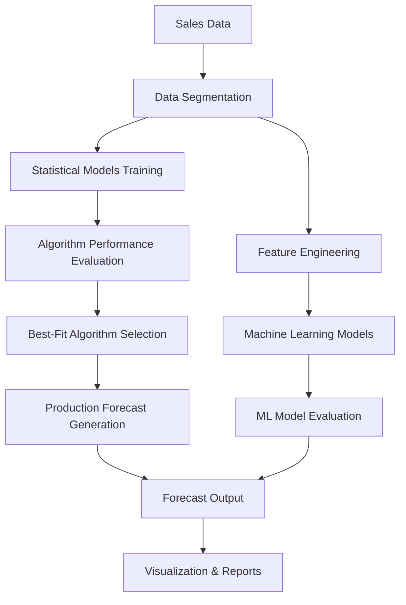

# Demand Forecasting System

A comprehensive demand forecasting application that predicts sales trends based on historical data using statistical models, machine learning, and best-fit algorithm selection.

## Current Project Status

**Stage**: Statistical Forecasting with Best-Fit Algorithm Selection ✅  
**Status**: Core functionality implemented and tested  
**Next Phase**: Machine Learning Integration

## Features

- **Data Segmentation**: Store-item level segmentation and classification
- **Statistical Forecasting**: 20+ forecasting algorithms (SES, TES, SARIMA, Prophet, etc.)
- **Best-Fit Analysis**: Automatic algorithm selection based on MAPE performance
- **Forecast Generation**: Production-ready forecasts using optimal algorithms
- **Machine Learning Models**: ML-based predictions (in development)
- **Data Visualization**: Comprehensive reporting and metrics

## Project Structure

```
DemandForecasting/
├── 📁 src/                           # Source code
│   ├── 📁 models/
│   │   ├── 📁 statistical/          # Statistical forecasting
│   │   │   ├── bestfit.py           # Best-fit algorithm analysis
│   │   │   ├── generate_bestfit.py  # Forecast generation
│   │   │   └── stat_forecast.py     # Statistical models system
│   │   └── 📁 ml/                   # Machine learning models
│   │       ├── models.py            # ML forecasting models
│   │       ├── feature.py           # Feature engineering
│   │       └── evaluation.py        # Model evaluation
│   │
│   ├── 📁 preprocessing/            # Data preprocessing
│   │ 
│   └── 📁 seg_rule/                 # Segmentation rules
│       ├── segmentation.py          # Data segmentation
│       └── rules.py                 # Business rules
│
├── 📁 utils/                         # Utility modules
│   ├── stat.py                      # Base forecasting models
│   ├── helpers.py                   # Helper functions
│   └── logging.py                   # Logging configuration
│
├── 📁 scripts/                       # Execution scripts
│   └── main.py                      # Main execution script
│
├── 📁 config/                        # Configuration
│   └── config.py                    # System configuration
│
└── 📁 apps/                          # Application layer
    └── app.py                        # Web application
```

## Core Workflow



## Key Components

### 1. Statistical Forecasting (`utils/stat.py`)
- **20+ Algorithms**: SES, TES, SARIMA, Prophet, Theta, STLF, etc.
- **Parameter Optimization**: Automatic parameter tuning
- **Error Handling**: Robust error management and logging

### 2. Best-Fit Analysis (`src/models/statistical/bestfit.py`)
- **MAPE Calculation**: Performance evaluation for each algorithm
- **Algorithm Selection**: Automatic best-fit identification
- **Output**: Store-item level optimal algorithm mapping

### 3. Forecast Generation (`src/models/statistical/generate_bestfit.py`)
- **Production Ready**: Generates forecasts using best-fit algorithms
- **Full Data Training**: Uses all available historical data
- **1-Cycle Forecasts**: 365-day forecasts for daily data

### 4. Segmentation System (`src/seg_rule/`)
- **Store-Item Classification**: Automatic segmentation
- **Business Rules**: Configurable segmentation logic
- **SEIL Classification**: Sales pattern categorization

## Usage

### Quick Start
```bash
# Run best-fit analysis
python scripts/main.py

# Generate forecasts (after best-fit analysis)
python src/models/statistical/generate_bestfit.py
```

### Programmatic Usage
```python
from src.models.statistical.bestfit import BestFitAnalyzer
from src.models.statistical.generate_bestfit import ForecastGenerator

# Best-fit analysis
analyzer = BestFitAnalyzer(results_df)
best_fit_results = analyzer.analyze_all_intersections()

# Generate forecasts
generator = ForecastGenerator(
    best_fit_results_path='data/best_fit_results.csv',
    sales_fact_path='data/sales_fact.csv',
    frequency='daily'
)
forecasts = generator.generate_all_forecasts()
```

## Output Files

- **`best_fit_results.csv`**: Best algorithm per store-item intersection
- **`generated_forecasts.csv`**: Production forecasts for next cycle
- **`results.csv`**: Validation results from model comparison

## Dependencies

- pandas, numpy
- statsmodels, scikit-learn
- prophet, pmdarima
- sktime, statsforecast
- matplotlib, seaborn (visualization)

## Next Steps

1. **Machine Learning Integration**: Complete ML model pipeline
2. **Web Interface**: Deploy forecasting dashboard
3. **Real-time Updates**: Automated retraining system
4. **Advanced Features**: External factor integration, promotion modeling
